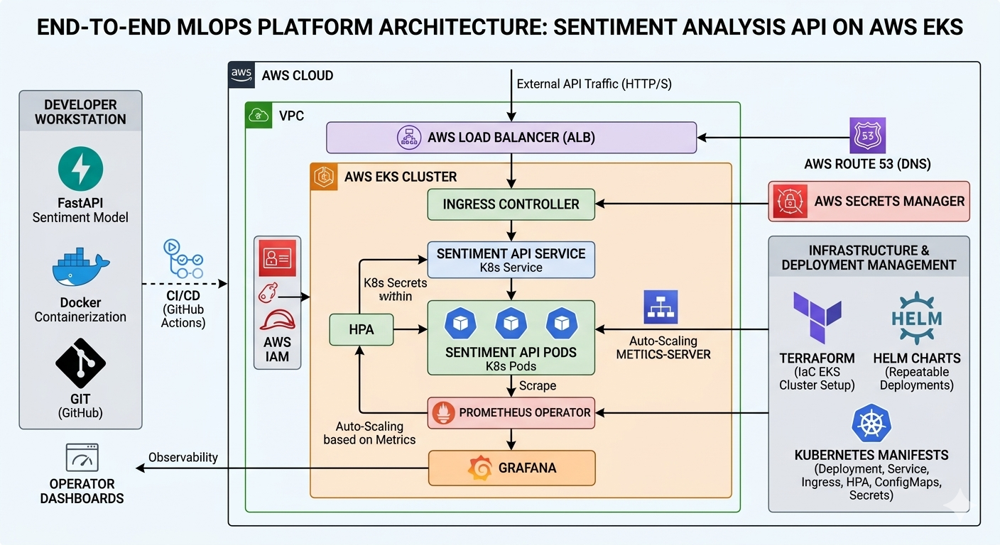

# 📊 End-to-End MLOps Kubernetes Flow

[](https://www.google.com/search?q=https://kubernetes.io/)
[](https://www.google.com/search?q=https://aws.amazon.com/)
[](https://www.google.com/search?q=https://www.terraform.io/)
[](https://www.google.com/search?q=https://helm.sh/)

## 📝 Project Overview

This project demonstrates a production-grade **MLOps pipeline** for deploying a Sentiment Analysis Machine Learning model. It transitions a local Python API into a highly available, auto-scaling, and monitored microservice running on **Amazon EKS (Elastic Kubernetes Service)**.

The focus is not just on the ML model, but on the **Platform Engineering** aspect: Infrastructure as Code (IaC), repeatable deployments using Helm, and deep observability.

-----

## 🏗 Architecture Diagram

The following diagram illustrates the complete flow from the developer's workstation to the AWS Cloud environment, including traffic routing and monitoring stacks.

-----

## 🛠 Technologies Used

  * **Machine Learning:** Python, Scikit-learn, FastAPI (API Layer).
  * **Infrastructure:** Terraform (IaC), AWS EKS, VPC, IAM.
  * **Containerization:** Docker, Docker Hub.
  * **Orchestration:** Kubernetes (K8s), Helm Charts.
  * **Traffic Management:** AWS Load Balancer Controller (ALB), Ingress.
  * **Observability:** Prometheus Operator, Grafana Dashboards.
  * **Scaling:** Metrics Server, Horizontal Pod Autoscaler (HPA).

-----

## ✅ Steps Accomplished

1.  **Model API Development:** Created a sentiment analysis service using FastAPI.
2.  **Containerization:** Built optimized Docker images and pushed them to Docker Hub.
3.  **Infrastructure as Code:** Leveraged **Terraform** to provision a production-ready EKS cluster with managed node groups and IAM OIDC providers.
4.  **Kubernetes Resource Management:** Initial deployment using standard Manifests (Deployments, Services, ConfigMaps, Secrets).
5.  **Traffic Control:** Configured **Ingress** with the AWS Load Balancer Controller to handle external traffic via an Application Load Balancer (ALB).
6.  **Auto-scaling:** Implemented **HPA** to dynamically scale pods based on CPU/Memory utilization.
7.  **Helm Chart Migration:** Refactored the entire deployment into a **Helm Chart** for modularity, versioning, and environment-specific overrides.
8.  **Full Observability:** Deployed **Prometheus & Grafana** to visualize cluster health and API performance.

-----

## 🎯 Why This Project?

In a real-world production environment, deploying a model is only 10% of the work. This project addresses the remaining 90%:

  * **Scalability:** How do we handle 1,000 requests vs 1,000,000? (HPA & EKS).
  * **Reliability:** How do we ensure zero downtime? (Rolling Updates & ALB).
  * **Reproducibility:** How do we recreate the environment in seconds? (Terraform & Helm).
  * **Visibility:** How do we know if the API is failing? (Prometheus/Grafana).

-----

## 🚀 How to Run

### Prerequisites

  * AWS CLI configured with Admin access.
  * Terraform, kubectl, and Helm installed.

### 1\. Provision Infrastructure

```bash
cd eks-cluster-setup
terraform init
terraform apply -auto-approve
```

### 2\. Deploy the Application (via Helm)

```bash
cd sentiment-chart
# Update values.yaml with your Docker image
helm install sentiment-release .
```

### 3\. Verify Deployment

```bash
kubectl get pods
kubectl get ingress
```

-----

## 📸 Screenshots

> *Note: ന്റെ ചേട്ടായി, add your specific screenshots here to prove the project is running\!*

### 1\. Grafana Dashboard

*Monitoring the API performance and CPU usage.*

### 2\. AWS EKS Console

*Showing the active nodes and pods.*

-----
