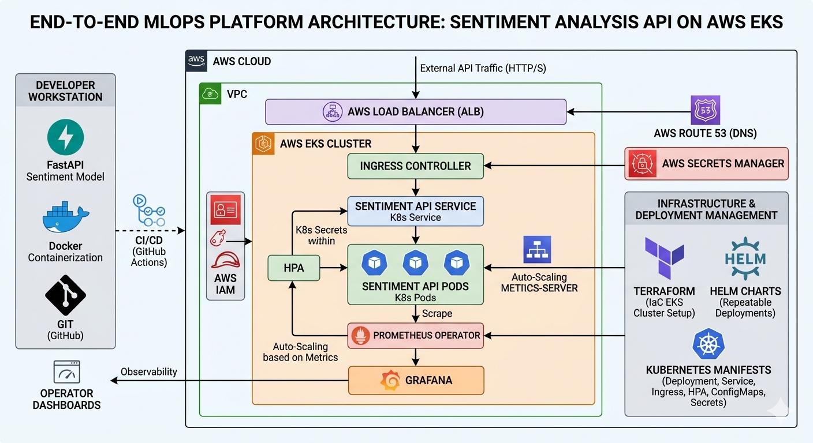
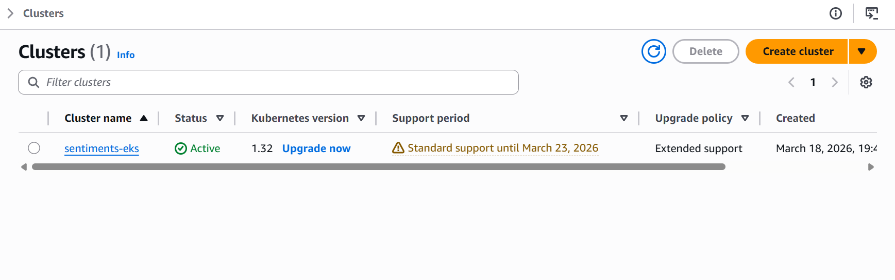
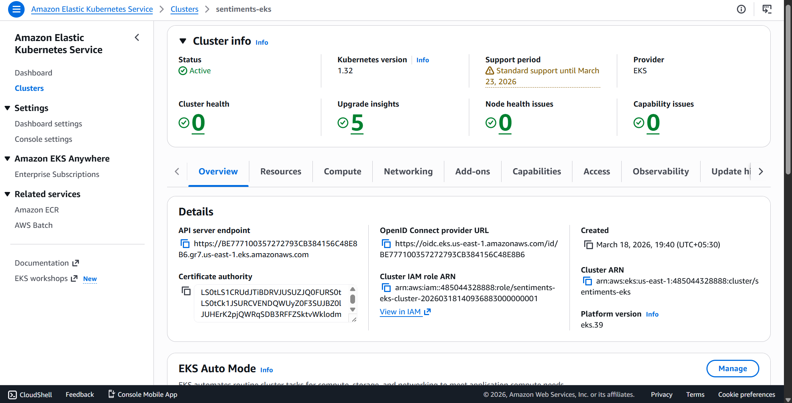
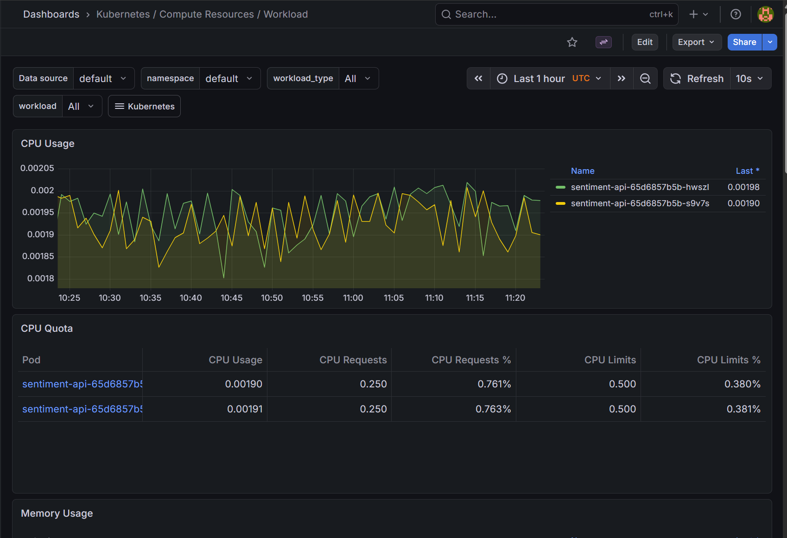
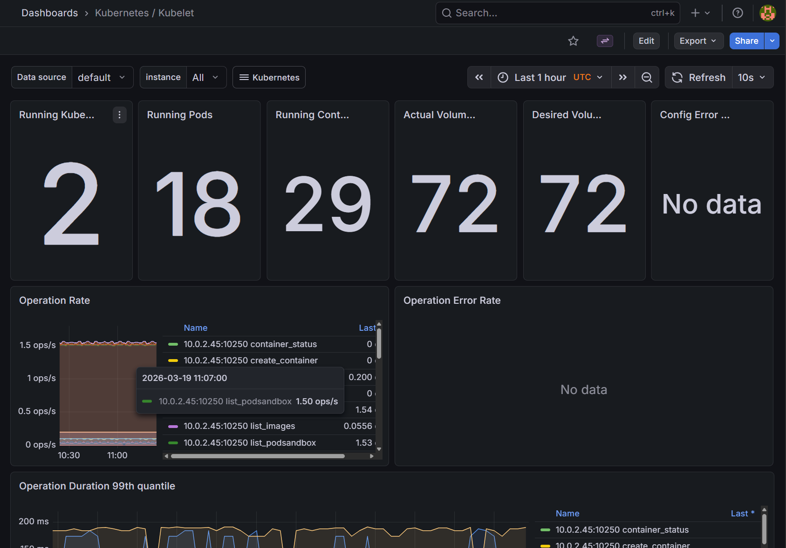

# End-to-End MLOps Platform with Kubernetes

---

# 1. Project Introduction

Hello Recruiter, let me walk you through an End-to-End MLOps project that demonstrates how machine learning models can be developed, deployed, monitored, and managed in a production environment using modern DevOps and Cloud Native practices.

The objective of this project is to automate the entire machine learning lifecycle, from model training to deployment and monitoring.

This project showcases:

* Machine Learning Operations (MLOps)
* CI/CD Automation
* Docker Containerization
* Kubernetes Deployment
* Cloud-Native Architecture
* Production Monitoring

---

# 2. Business Problem

In many organizations, machine learning models are developed successfully but face challenges during deployment and maintenance.

Common problems include:

* Manual deployments
* Environment inconsistencies
* Difficult scaling
* Lack of monitoring
* Slow release cycles

The goal of this solution is to create a reliable and automated process for deploying and managing ML models in production.

---

# 3. My Role as Technical Project Manager

From a TPM perspective, my responsibilities would include:

* Managing project delivery
* Coordinating Data Science, Development, QA, and DevOps teams
* Sprint planning and execution
* Stakeholder communication
* Release planning
* Risk management
* Production readiness reviews
* Monitoring project milestones

My role is to ensure successful delivery while aligning technical execution with business objectives.

---

# 4. High-Level Architecture

The overall flow is:

Data Collection

↓

Data Processing

↓

Model Training

↓

Model Validation

↓

Docker Container

↓

CI/CD Pipeline

↓

Kubernetes Cluster

↓

Production Deployment

↓

Monitoring & Observability

The pipeline ensures that model updates can move smoothly from development to production.

---

# 5. Technology Stack

Machine Learning

* Python
* Scikit-Learn
* Pandas
* NumPy

Backend

* Flask / FastAPI

Containerization

* Docker

Container Orchestration

* Kubernetes

Version Control

* GitHub

CI/CD

* GitHub Actions

Cloud

* AWS

Monitoring

* Prometheus
* Grafana

Project Management

* Jira
* Confluence

---

# 6. Machine Learning Workflow

The workflow consists of:

Step 1:

* Collect training data

Step 2:

* Clean and preprocess data

Step 3:

* Train machine learning model

Step 4:

* Validate model performance

Step 5:

* Package model as a deployable service

Step 6:

* Deploy to Kubernetes

This creates a repeatable and scalable ML deployment process.

---

# 7. Docker Containerization

To ensure consistency across environments:

* Application is packaged into Docker containers.
* Same image is used in Development, QA, and Production.
* Eliminates "works on my machine" issues.

Benefits:

* Faster deployments
* Better portability
* Easier maintenance

---

# 8. CI/CD Pipeline

One of the key strengths of this project is automation.

Deployment flow:

Developer Commit

↓

GitHub Repository

↓

GitHub Actions

↓

Build Docker Image

↓

Run Validation Checks

↓

Push Image

↓

Deploy to Kubernetes

Benefits:

* Faster releases
* Reduced manual effort
* Improved deployment reliability
* Consistent delivery process

---

# 9. Kubernetes Deployment

The application is deployed on Kubernetes.

Kubernetes provides:

* Automated deployment
* Self-healing capabilities
* Load balancing
* Scaling
* High availability

If a pod fails:

* Kubernetes automatically creates a new pod.

This improves system reliability and uptime.

---

# 10. Scaling Demonstration

One key benefit of Kubernetes is scalability.

If user traffic increases:

* Additional pods can be created automatically.
* Load gets distributed across instances.
* Performance remains stable.

This allows the platform to handle business growth efficiently.

---

# 11. Monitoring and Observability

Production monitoring is critical for any enterprise application.

This project uses:

## Prometheus

Used for:

* Metrics collection
* Application monitoring
* Resource utilization tracking

## Grafana

Used for:

* Dashboards
* Visualization
* Performance monitoring

Important Metrics:

* Response times
* CPU utilization
* Memory utilization
* Request volume
* Error rates

---

# 12. Risk Management Approach

As a TPM, I would proactively manage risks such as:

* Deployment failures
* Infrastructure outages
* Model performance degradation
* Capacity issues
* Security vulnerabilities

Mitigation strategies:

* Monitoring alerts
* Rollback plans
* Deployment validation
* Disaster recovery planning
* Capacity planning

---

# 13. Agile Delivery Approach

A sample delivery plan could be:

Sprint 1

* Requirements gathering
* Architecture design

Sprint 2

* Data preparation
* Model development

Sprint 3

* API development
* Dockerization

Sprint 4

* CI/CD pipeline setup

Sprint 5

* Kubernetes deployment

Sprint 6

* Monitoring setup
* UAT testing

Sprint 7

* Production rollout

Throughout the project:

* Daily standups
* Sprint planning
* Sprint reviews
* Retrospectives
* Stakeholder demos

---

# 14. Release Management

Before production deployment:

* Code review completed
* Testing completed
* Security checks completed
* Deployment validation completed
* Rollback plan prepared

This minimizes production risks.

---

# 15. Business Benefits

This solution provides:

* Faster deployment cycles
* Reduced operational effort
* Improved reliability
* Better scalability
* Higher deployment consistency
* Faster time-to-market

---

# 16. Project Outcome

This project demonstrates:

* End-to-End MLOps lifecycle
* CI/CD implementation
* Docker containerization
* Kubernetes orchestration
* Monitoring and observability
* Agile project execution

From a Technical Project Manager perspective, it showcases:

* Technical understanding
* Delivery ownership
* DevOps awareness
* Cloud platform knowledge
* Risk management
* Stakeholder communication
* End-to-end project coordination

Thank you. I would be happy to answer any questions regarding the architecture, delivery approach, Kubernetes deployment, CI/CD pipeline, or project management aspects of this solution.


=====================================
# 📊 End-to-End MLOps Kubernetes Flow

[](https://www.google.com/search?q=https://kubernetes.io/)
[](https://www.google.com/search?q=https://aws.amazon.com/)
[](https://www.google.com/search?q=https://www.terraform.io/)
[](https://www.google.com/search?q=https://helm.sh/)

## 📝 Project Overview

This project demonstrates a production-grade **MLOps pipeline** for deploying a Sentiment Analysis Machine Learning model. It transitions a local Python API into a highly available, auto-scaling, and monitored microservice running on **Amazon EKS (Elastic Kubernetes Service)**.

The focus is not just on the ML model, but on the **Platform Engineering** aspect: Infrastructure as Code (IaC), repeatable deployments using Helm, and deep observability.

-----

## 🏗 Architecture Diagram

The following diagram illustrates the complete flow from the developer's workstation to the AWS Cloud environment, including traffic routing and monitoring stacks.


-----

## 🛠 Technologies Used

  * **Machine Learning:** Python, Scikit-learn, FastAPI (API Layer).
  * **Infrastructure:** Terraform (IaC), AWS EKS, VPC, IAM.
  * **Containerization:** Docker, Docker Hub.
  * **Orchestration:** Kubernetes (K8s), Helm Charts.
  * **Traffic Management:** AWS Load Balancer Controller (ALB), Ingress.
  * **Observability:** Prometheus Operator, Grafana Dashboards.
  * **Scaling:** Metrics Server, Horizontal Pod Autoscaler (HPA).

-----

## ✅ Steps Accomplished

1.  **Model API Development:** Created a sentiment analysis service using FastAPI.
2.  **Containerization:** Built optimized Docker images and pushed them to Docker Hub.
3.  **Infrastructure as Code:** Leveraged **Terraform** to provision a production-ready EKS cluster with managed node groups and IAM OIDC providers.
4.  **Kubernetes Resource Management:** Initial deployment using standard Manifests (Deployments, Services, ConfigMaps, Secrets).
5.  **Traffic Control:** Configured **Ingress** with the AWS Load Balancer Controller to handle external traffic via an Application Load Balancer (ALB).
6.  **Auto-scaling:** Implemented **HPA** to dynamically scale pods based on CPU/Memory utilization.
7.  **Helm Chart Migration:** Refactored the entire deployment into a **Helm Chart** for modularity, versioning, and environment-specific overrides.
8.  **Full Observability:** Deployed **Prometheus & Grafana** to visualize cluster health and API performance.

-----

## 🎯 Why This Project?

In a real-world production environment, deploying a model is only 10% of the work. This project addresses the remaining 90%:

  * **Scalability:** How do we handle 1,000 requests vs 1,000,000? (HPA & EKS).
  * **Reliability:** How do we ensure zero downtime? (Rolling Updates & ALB).
  * **Reproducibility:** How do we recreate the environment in seconds? (Terraform & Helm).
  * **Visibility:** How do we know if the API is failing? (Prometheus/Grafana).

-----

## 🚀 How to Run

### Prerequisites

  * AWS CLI configured with Admin access.
  * Terraform, kubectl, and Helm installed.

### 1\. Provision Infrastructure

```bash
cd eks-cluster-setup
terraform init
terraform apply -auto-approve
```

### 2\. Deploy the Application (via Helm)

```bash
cd sentiment-chart
# Update values.yaml with your Docker image
helm install sentiment-release .
```

### 3\. Verify Deployment

```bash
kubectl get pods
kubectl get ingress
```

-----

## 📸 Screenshots

### 1\. EKS Cluster Status



### 2\. Kubernetes Cluster Health




### 3\. Scaling-Workloads Details



### 4\. Scaling-Kubelet Details



-----
